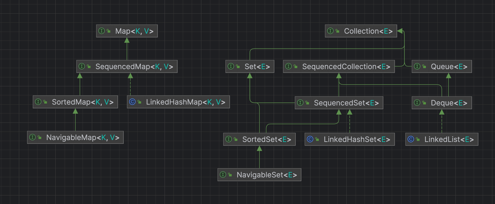

# What's new in Java 21 compared to 17

Sources:
- [primary JEPs list](https://openjdk.org/projects/jdk/21/jeps-since-jdk-17)
- [official blog post](https://blogs.oracle.com/java/post/the-arrival-of-java-21)
- [Jose PAUMARD's talk](https://youtu.be/14RDbiF2a_o) - not equal to 21 scope

## [Project Amber](https://openjdk.org/projects/amber/)

(changes to language)

### Pattern Matching

JDK21 additions regarding patterns build on top of constructs already present in JDK17:
- switch expressions
- pattern matching instanceof
- record classes

#### Switch _expressions_ as of JDK 17

They were added in [Java 14](https://openjdk.org/jeps/361).

- it's an expression, i.e. it returns a value and can be placed anywhere a variable can
- it's exhaustive: default clause is required or all available cases accounted for (with enums)
- switch variable is still limited to int, String and enum types
- switching over null will raise an NPE

Syntactically it stands out by addition of `->` syntax, lack of `break`, and `yield` replacing `return`.

```java
int j = switch (day) {
    case MONDAY -> 0;
    case TUESDAY -> 1;
    default -> {
        int k = day.toString().length();
        int result = f(k);
        yield result;
    }
};

// colon syntax
int result = switch (s) {
    case "Foo":
    case "Bar":
        yield 2;
    default:
        System.out.println("Neither Foo nor Bar, hmmm...");
        yield 0;
};
```

#### Type Patterns as of JDK 17

Added in [Java 16](https://openjdk.org/jeps/394) for instanceof operator. 

```java
//      |   type pattern  |        guard     |
if (obj instanceof String s && s.length() > 5) {
    flag = s.contains("jdk");
}
```

#### [JEP 441: Pattern Matching for switch](https://openjdk.org/jeps/441)

Pattern Matching added to switch expressions:
```java
Integer i = ...
switch (i) {
    case -1, 1 -> ...                   // Special cases
//      |type pattern|    guard   |
    case Integer jjjj when jjjj > 0 -> ...    // Positive integer cases
    case Integer j -> ...               // All the remaining integers
}
```

Aside from patterns:
1. cases are evaluated in natural order, for exhaustiveness check details refer to JEP
2. switch over null is allowed either by `case null`, or by combining with `case null, default`
```java
var x = switch (o) {
    case null -> "null";
    case String s -> "String!";
    default -> "default";
}
// null

var x = switch (o) {
    case String s -> "String!";
    case null, default -> "default or null";
}
//default or null

var x = switch (o) {
    case String s -> "String!";
    default -> "default";
};
// Exception in thread "main" java.lang.NullPointerException
```
3. switch variable type limitation is lifted, it's possible to refer to enum element via class
```java
sealed interface CardClassification permits Suit, Tarot {}
public enum Suit implements CardClassification { CLUBS, DIAMONDS, HEARTS, SPADES }
final class Tarot implements CardClassification {}

static void exhaustiveSwitchWithBetterEnumSupport(CardClassification c) {
    switch (c) {
        case Suit.CLUBS -> {
            System.out.println("It's clubs");
        }
        case Suit.DIAMONDS -> {
            System.out.println("It's diamonds");
        }
        case Suit.HEARTS -> {
            System.out.println("It's hearts");
        }
        case Suit.SPADES -> {
            System.out.println("It's spades");
        }
        case Tarot t -> {
            System.out.println("It's a tarot");
        }
    }
}
```

#### [JEP 440: Record Patterns](https://openjdk.org/jeps/440)

In addition to Type Patterns, Record Patterns were added, combining record matching with record decomposition.

**Syntax**
```java
record Pair(Object x, Object y) {}

// instanceof syntax
//               |      record pattern    |  guard   |
//             type->|         |<-pattern
if (p instanceof Pair(Integer x, Integer y) && y < 10) {
    System.out.println(x + ", " + y + " < 10");
}

// switch syntax
System.out.println(switch (o) {
//       |      record pattern    |   guard     |
//     type->|         |<-pattern   
    case Pair(Integer x, Integer y) when y < 10 -> x + ", " + y + " < 10";
});
```
Type and record patterns can be nested. As a bonus, decomposition adds symmetry with instantiation
```java
Rectangle r = new Rectangle(new ColoredPoint(new Point(x1, y1), c1), 
                            new ColoredPoint(new Point(x2, y2), c2));

if (r instanceof Rectangle(ColoredPoint(Point(var x, var y), var c),
                           var lr)) {
    System.out.println("Upper-left corner: " + x);
}                            
```

### Preview Features

(!) Following JEPs require enabling experimental features to compile and run.

```shell
javac --enable-preview --release 21 Jep443.java
java --enable-preview Jep443
```

#### [JEP 443: Unnamed Patterns and Variables (Preview)](https://openjdk.org/jeps/443)

Allows use of `_` to clearly indicate unused variable, e.g. when function returns a constant. 

In record matching `_` type pattern is shorthand for `var _` and marches everything.

```java
record Point(int x, int y) { }
enum Color { RED, GREEN, BLUE }
record ColoredPoint(Point p, Color c) { }

r instanceof ColoredPoint(Point(int x, int _), Color _)
case Point(int x, _) -> ... x ...
```

In regular code. 

```java
// examples
Queue<Integer> q = ... // x1, y1, z1, x2, y2, z2, ...
while (q.size() >= 3) {
   var x = q.remove();
   var y = q.remove();
   var _ = q.remove();
   ... new Point(x, y) ...
}

String s = ...
try { 
    int i = Integer.parseInt(s);
    ... i ...
} catch (NumberFormatException _) { 
    System.out.println("Bad number: " + s);
}

...stream.collect(Collectors.toMap(String::toUpperCase, _ -> "NODATA"))
```

#### [JEP 430: String Templates (Preview)](https://openjdk.org/jeps/430)

Java flavour for string interpolation. 

```java
String foo = "bar";
System.out.println(STR."\{foo}"); // prints bar
//              ->|    |<- template processor 
```

Template processors are intended to provide context related validation and escaping,
e.g. json, sql, html, etc.

#### [JEP 445: Unnamed Classes and Instance Main Methods (Preview)](https://openjdk.org/jeps/445)

Stated goal is to reduce `psvm`-like ceremony for beginners in Java or programming in general.
javac allows for unnamed classes in unnamed package, java does a main lookup (refer to JEP for details).

`main` method may:
- be an instance method
- have any visibility aside from private
- omit input parameters 

Now Hello World could look concise as 
```java
void main() {
    System.out.println("Hello world");
}
```

## Project Loom

### [JEP 444: Virtual Threads](https://openjdk.org/jeps/444)

Virtual Thread (VT) is `java.lang.Thread`, that's run by (mounted on) platform (OS) thread (PT).
When VT blocks, PT moves VT's stack to the heap and executes next VT, allowing for high CPU utilization by few PTs. 
When VT is unblocked, it's run by JVM scheduler (FIFO). 

Implications:
- VTs are cheap and abundant: no need for pooling
- concurrency primitives works for VTs as for PTs
- one can write in single-threaded thread-per-request style with same efficiency as in async frameworks, 
keeping the benefits of single-threaded apps such as profiling, logging, etc
- thread pools can no longer serve as an implicit rate limiters to other scarce resources (e.g. DB connections); 
instead explicit rate limiting need to be done, e.g. with Semaphores
- similarly, ThreadLocal becomes a bad storage for expensive resources, since there could be numerous copies

Running code on VT executor:
```java
try (var executor = Executors.newVirtualThreadPerTaskExecutor()) {
    IntStream.range(0, 1_000_000).forEach(i -> {
        executor.submit(() -> {
            Thread.sleep(Duration.ofSeconds(1));
            return i;
        });
    });
}  // executor.close() is called implicitly, and waits
// took 7 seconds to complete
```

### Preview Features

(!) Following JEPs require enabling experimental features to compile and run.

```shell
javac --enable-preview --release 21 Jep443.java
java --enable-preview Jep443
```

#### [JEP 453: Structured Concurrency (Preview)](https://openjdk.org/jeps/453)

When executing tres of tasks allows to declare inter-task dependencies and get, for example, clear cascading subtask cancellation.

```java
// all subtask succeed to succeed
try (var scope = new StructuredTaskScope.ShutdownOnFailure()) {
    Supplier<String>  user  = scope.fork(() -> findUser()); // note Supplier instead of a future. 
    Supplier<Integer> order = scope.fork(() -> fetchOrder());

    scope.join()            // Join both subtasks
         .throwIfFailed();  // ... and propagate errors

    // Here, both subtasks have succeeded, so compose their results
    return new Response(user.get(), order.get());
}

// any subtask succeed to succeed
<T> T race(List<Callable<T>> tasks, Instant deadline) 
        throws InterruptedException, ExecutionException, TimeoutException {
    try (var scope = new StructuredTaskScope.ShutdownOnSuccess<T>()) {
        for (var task : tasks) {
            scope.fork(task);
        }
        return scope.joinUntil(deadline)
                    .result();  // Throws if none of the subtasks completed successfully
    }
}
```

#### [JEP 446: Scoped Values (Preview)](https://openjdk.org/jeps/446)

`ThreadLocal` replacement to distribute readonly shared variables between threads, controlled by try with resources. 

```java
class Frameowrk {
    private final static ScopedValue<FrameworkContext> CONTEXT 
                        = ScopedValue.newInstance();   // (1)

    void serve(Request request, Response response) {
        var context = createContext(request);
        ScopedValue.where(CONTEXT, context)            // (2)
                   .run(() -> Application.handle(request, response));
    }
    
    public PersistedObject readKey(String key) {
        var context = CONTEXT.get();            // (3)
        var db = getDBConnection(context);
        db.readKey(key);
    }
    
    ...
}
```


## API

### [JEP 431: Sequenced Collections](https://openjdk.org/jeps/431)

Added new interfaces to existing collections:
```java
interface SequencedCollection<E> extends Collection<E> {
    // new method
    SequencedCollection<E> reversed();
    // methods promoted from Deque
    void addFirst(E);
    void addLast(E);
    E getFirst();
    E getLast();
    E removeFirst();
    E removeLast();
}

interface SequencedSet<E> extends Set<E>, SequencedCollection<E> {
    SequencedSet<E> reversed();    // covariant override
}

interface SequencedMap<K,V> extends Map<K,V> {
    // new methods
    SequencedMap<K,V> reversed();
    SequencedSet<K> sequencedKeySet();
    SequencedCollection<V> sequencedValues();
    SequencedSet<Entry<K,V>> sequencedEntrySet();
    V putFirst(K, V);
    V putLast(K, V);
    // methods promoted from NavigableMap
    Entry<K, V> firstEntry();
    Entry<K, V> lastEntry();
    Entry<K, V> pollFirstEntry();
    Entry<K, V> pollLastEntry();
}
```




### [JEP 418: Internet-Address Resolution SPI](https://openjdk.org/jeps/418)

`InetAddressResolverProvider` SPI added to allow overriding platform name resolution (testing, new protocol support).

```java
InetAddress inetAddress = InetAddress.getByName("google.com");
System.out.println(inetAddress);
// default - google.com/142.250.206.142
// return Stream.of(InetAddress.getByAddress(host, new byte[]{1, 1, 1, 1}));
// with SPI registered - google.com/1.1.1.1
```

[example](./Jep418) in full.

### [JEP 400: UTF-8 by Default](https://openjdk.org/jeps/400)

Before java.nio.* had UTF-8 default, while java.io.* was system dependent.
Now UTF-8 is default charset (overridable by property) everywhere. 

Problem:

```
java.io.FileReader(“hello.txt”) -> “こんにちは” (macOS)
java.io.FileReader(“hello.txt”) -> “ã?“ã‚“ã?«ã?¡ã? ” (Windows (en-US))
java.io.FileReader(“hello.txt”) -> “縺ォ縺。縺ッ” (Windows (ja-JP)
```


## Headlines only

- [JEP 408: Simple Web Server](https://openjdk.org/jeps/408): 
library/jdk utility to run file serving web server (??? lol)
- [JEP 413: Code Snippets in Java API Documentation](https://openjdk.org/jeps/413): javadoc enhancement to embed code
- [JEP 416: Reimplement Core Reflection with Method Handles](https://openjdk.org/jeps/416):
internal rewrite to reduce maintenance cost
- [JEP 421: Deprecate Finalization for Removal](https://openjdk.org/jeps/421): you will be missed (no)
- [JEP 422: Linux/RISC-V Port](https://openjdk.org/jeps/422): new OpenJDK port
- [JEP 439: Generational ZGC](https://openjdk.org/jeps/439): ZGC with generations model
- [JEP 449: Deprecate the Windows 32-bit x86 Port for Removal](https://openjdk.org/jeps/449): 
no virtual threads for you, Windows ~~10~~ XP 
- [JEP 451: Prepare to Disallow the Dynamic Loading of Agents](https://openjdk.org/jeps/451): 
future security enhancement, will require explicit `-XX:+EnableDynamicAgentLoading`, for now you'll get warnings
- [JEP 452: Key Encapsulation Mechanism API](https://openjdk.org/jeps/452): something something modern crypto
- [JEP 442: Foreign Function & Memory API (Third Preview)](https://openjdk.org/jeps/442): 
future JNI successor: typed api written in pure Java
- [JEP 448: Vector API (Sixth Incubator)](https://openjdk.org/jeps/448): 
hardware agnostic vector computing support
