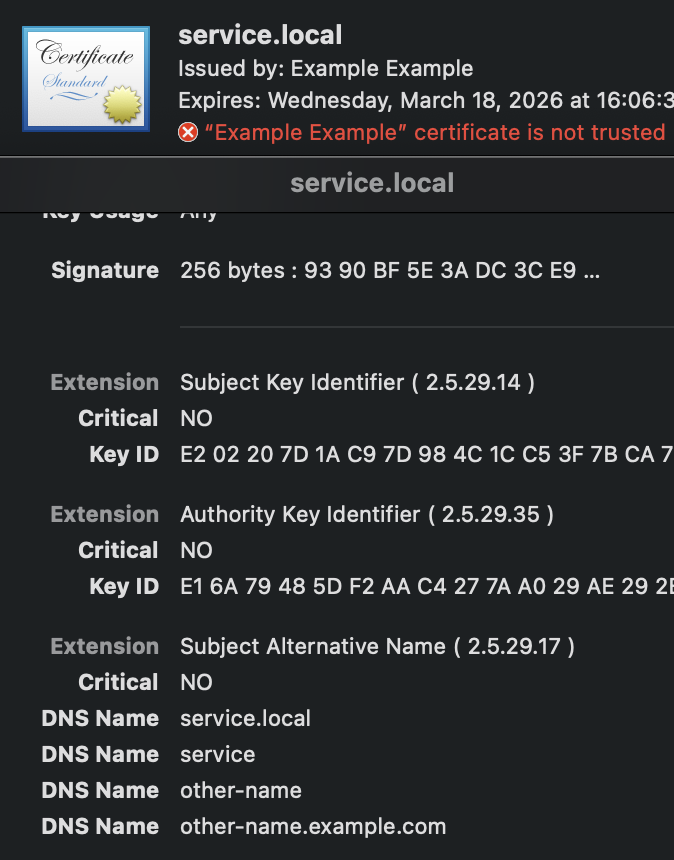

# Personal CA + self-signed TLS certificates

## Creating private Certificate Authority

```sh
# generate CA private key
openssl genrsa -des3 -out exampleCA.key 2048
# enter password

# generate CA certificate
openssl req -x509 -new -nodes -key exampleCA.key -sha256 -days 8250 -out exampleCA.pem
# provide certificate params (all optional, but better fill something)

# install CA as trusted root (MacOS)
sudo security add-trusted-cert -d -r trustRoot -k /Library/Keychains/System.keychain example.pem
security add-trusted-cert -d -r trustRoot -k ~/Library/Keychains/login.keychain example.pem
```


## Creating sertificate for a service

```sh
# generate service private kay
openssl genrsa -out service.key 2048

# create service ssl config
touch service.openssl.cnf
code service.openssl.cnf
```

Config:

```ini
[ req ]
default_bits            = 2048
encrypt_key             = no
default_md              = sha256
utf8                    = yes
string_mask             = utf8only
prompt                  = no
distinguished_name = req_distinguished_name
req_extensions     = req_ext

[req_distinguished_name]
C = AU
CN = service.local

[req_ext]
subjectAltName = @alt_names

[alt_names]
DNS.1 = service.local
DNS.2 = service
DNS.3 = other-name
DNS.4 = other-name.example.com
```

Generate Certificate Signing Request

```sh
# generate certificate sign request
openssl req -new -sha256 -out service.csr -key service.key -config service.openssl.cnf

# validate X509v3 Subject Alternative Name: DNS: *
openssl req -in service.csr -noout -text

# validate that SANs are present:
# .....
#        Attributes:
#            Requested Extensions:
#                X509v3 Subject Alternative Name: 
#                    DNS:service.local, DNS:service, DNS:other-name, DNS:other-name.example.com
```

Generate and sign Certificate from CSR

```sh
openssl x509 -req -in service.csr -CA exampleCA.pem -CAkey exampleCA.key -CAcreateserial -out service.crt -days 825 -sha256 -extensions req_ext -extfile service.openssl.cnf
```

Inspect certificate for SANs presence



Deploy `service.crt` and `service.kay`. 

## Sources

- ChatGPT
- [stackexchange](https://security.stackexchange.com/questions/74345/provide-subjectaltname-to-openssl-directly-on-the-command-line)
- [article 1](https://thesecmaster.com/how-to-generate-a-csr-for-multi-domain-ssl-certificates-using-openssl/)
- [article 2](https://medium.com/@spawnrider/creating-a-multi-domain-san-ssl-certificate-using-openssl-2a3865ccb62a)